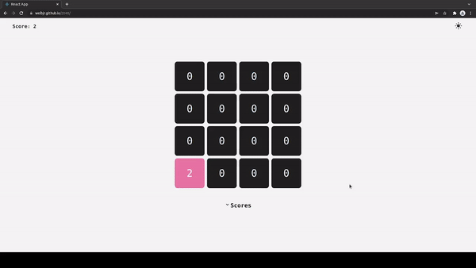

# Apresentação

Clone de 2048 feito com React. Link para jogar: https://welbjr.github.io/2048/



# Instalação

1. Instale as dependências
2. Inicie o servidor de desenvolvimento

```sh
npm install
npm start
```
